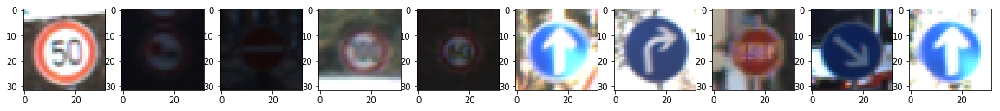
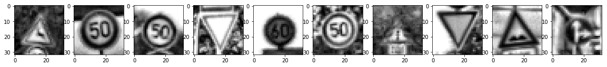
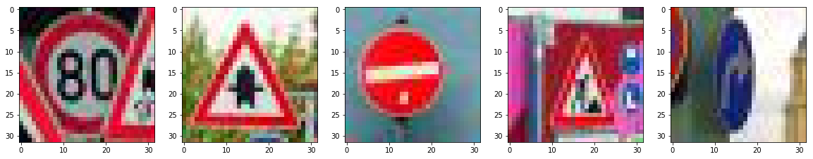

# Self-Driving Car Engineer Nanodegree

## Project: **Traffic Sign Recognition** 

The goals / steps of this project are the following:
* Explore, summarize and visualize the data set
* Design, train and test a model architecture which capable of achieving at least 97% validation accuracy
* Use the model to make predictions on new images
* Analyze the softmax probabilities of the new images

Rubric: [link](https://review.udacity.com/#!/rubrics/481/view)

### Data Set Summary & Exploration

Knowing your dataset is crucial. The first step is to check how much data we have because Neural Networks are not efficient under tens of thousands of training sample.
Second step is to get information about the structure of the data. In this case we have 32x32 RGB pictures.
Third step is  to get information about the representation of classes (labels). It is very important to have a proper number of sample for all class. (Not perfect but good enough.) Also the training, validation and test set should have the same distribution between classes. (OK)
Fourth step is to visualize the data. In this step I learned that the light intensity of the samples differ greatly. Also blurry pictures are present in the dataset.

I chose not to augment my dataset with additional images modified from existing samples(size/rotation/colors/etc.). It could be a potential improvement point.

### Design and Test a Model Architecture

#### Preprocessing

All samples were converted to grayscale. The colors mean additional structure which is not as useful as the resources their learning require. The designed NN will be leaner this way. (Test were conducted on RGB and HLS (only H and S channels) images.)

The light intensity and blurry samples require some attention. I used adaptive histogram equalization (CLAHE). The sample resolution is very small so the smallest possible window(3x3) was used.

As a last step, I normalized the image data because the solver works better.

#### Model architecture

My final model consisted of the following layers:

| Layer         		|     Description	        					| 
|:---------------------:|:---------------------------------------------:| 
| Input         		| 32x32x1 Grayscale image						| 
| Convolution 5x5     	| 1x1 stride, valid padding, outputs 28x28x32 	|
| RELU					|												|
| Dropout				| 90%											|
| Max pooling	      	| 2x2 stride, outputs 14x14x32 					|
| Convolution 5x5	    | 1x1 stride, valid padding, outputs 10x10x64 	|
| RELU					|												|
| Dropout				| 80%											|
| Flatten				| Outputs 6400 									|
| Fully connected		| Outputs 120 									|
| RELU					|												|
| Dropout				| 70%											|
| Fully connected		| Outputs 43 (classes)							|
| Softmax				| 												|
 

#### Hyperparameters

* Adam optimizer
* EPOCHS = 80 (Over 80 the NN starts to memorize the dataset.)
* Learning rate = 0.001 (Higher rate resulted in bigger swings in validation accuracy.)
* BATCH_SIZE = 128

#### 4. Design history

My final model results were:
* validation set accuracy: 0.976 (0.968-0.980 in a few run)
* test set accuracy: 0.958

First I run a few test on the LeNet model with samples which had
* 3 color channel (RGB)
* 1 color channel (greyscale, no preprocessing)
* 2 color channel (H and S from HLS)

I decided to use greyscale images due to superior performance. The depth of the convolutional layers were increased as the initial architecture (LeNet) was developed for simplier data structure (hand-written numbers).

The model learned too quickly so I decided to introduce droupout between the layers. For the convolutional layers only a low dropout rate increased the performance.

Later I removed the pooling after the 2nd convolutional layers. An increased dropout rate in combination with a wider follow-up layer performed better. However the first convolutional layer seems to work well with a pooling / low dropout rate combination.

The following parameters were not investigated:
* Stride and window size for first convolutional layer (I don't expect any improvement here.)
* Pooling window size for first convolutional layer (I don't expect any improvement here.)
* Stride and window size for second convolutional layer 
* Pooling window size for second convolutional layer (I don't expect any improvement here.)
* Output size of first fully connected layer
* Effect of additional convolutional layer layers

### Test a Model on New Images

#### Control pictures

The following test images were collected from the internet.

The first image might be difficult to classify because it is partially masked by other signs.
The second and third picture should not be a challange for the NN.
The fourth image might be difficult to classify because the background color creates very small contrast with the edge of the table.
The fifth image is not facing the lane/car/camera. Having a clear recognition for this table could be problematic for the decision making AI of a self-driving car.

#### Predictions

The NN made the following prediction (rounded):
1. 1st image:
   * Speed limit (80km/h) 94%
   * Speed limit (20km/h) 6%
2. 2nd image:
   * Right-of-way at the next intersection 100%
3. 3rd image:
   * No entry 100%
4. 4th image: 
   * Road work 82%
   * Speed limit (50km/h) 18%
5. 5th image:
   * Roundabout mandatory 55%
   * Right-of-way at the next intersection 42%
   * Turn left ahead 2%

The predictions are correct for the first four. As hoped the NN assigned multiple low probability class for the fifth image. However I expected at least three more or less equal probability which could be discarded by high confidentiality.
